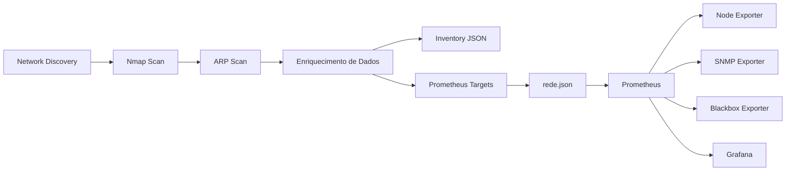
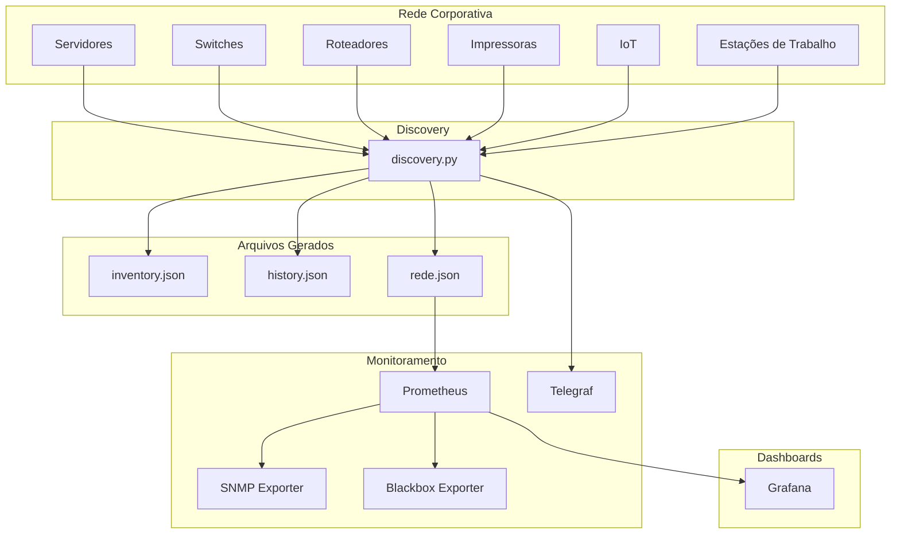
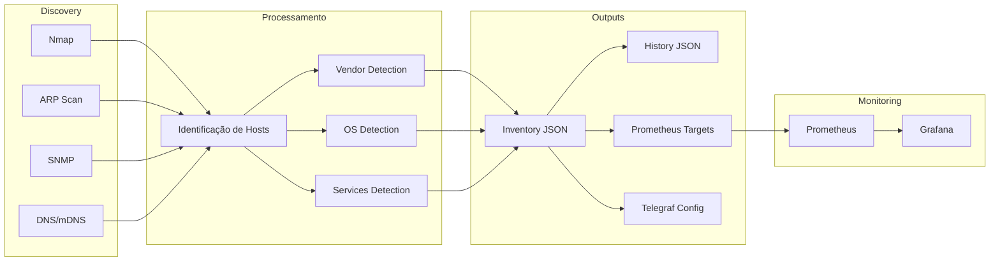

# 🔍 Network Discovery for Prometheus & Telegraf

> Descoberta automática de dispositivos em rede, geração de inventário, integração com Prometheus e atualização dinâmica de configurações do Telegraf.

<p>
  
  
  
</p>

## 📖 Sobre o Projeto

Este projeto realiza a descoberta automática de ativos em uma rede local utilizando ferramentas como **Nmap** e **ARP Scan**, enriquecendo os dados encontrados com informações de:

- Nome amigável baseado em MAC Address
- Fabricante (Vendor)
- Sistema Operacional
- Tipo do dispositivo
- Portas e serviços disponíveis
- Resolução DNS e mDNS
- Latência
- Informações via SNMP

Ao final da execução são gerados automaticamente:

✅ Inventário completo dos dispositivos

✅ Arquivo de targets para o Prometheus

✅ Configuração de monitoramento para o Telegraf

✅ Histórico de dispositivos descobertos

O objetivo é facilitar a gestão de infraestrutura e o monitoramento contínuo de ambientes corporativos, laboratórios ou homelabs.

---

## ✨ Funcionalidades

### 🔎 Descoberta de Hosts

- Varredura de rede com Nmap
- Descoberta de dispositivos ativos
- Resolução de nomes DNS
- Resolução de nomes mDNS
- Identificação de MAC Address

### 🏷️ Classificação de Dispositivos

- Associação MAC → Nome amigável
- Identificação de fabricante
- Classificação automática de dispositivos

Exemplos:

- Servidores
- Workstations
- Notebooks
- Switches
- Roteadores
- Impressoras
- Equipamentos IoT

### 📊 Coleta Avançada

- Verificação de latência
- Detecção de sistema operacional
- Levantamento de portas abertas
- Identificação de serviços
- Consulta SNMP

### 📈 Integração com Observabilidade

- Geração automática de Service Discovery para Prometheus
- Atualização automática das configurações do Telegraf
- Reinício automático do serviço Telegraf

### 📝 Histórico de Ativos

- Registro persistente dos hosts encontrados
- Comparação entre execuções
- Rastreamento de alterações da rede

---

## 📈 Integração com Prometheus

Uma das principais funcionalidades deste projeto é a geração automática de arquivos de **Service Discovery** para o Prometheus.

Durante a execução do processo de descoberta, todos os hosts identificados na rede são processados e exportados para um arquivo JSON compatível com a funcionalidade `file_sd_config` do Prometheus.

Isso elimina a necessidade de manter listas de targets manualmente, permitindo que novos dispositivos passem a ser monitorados automaticamente.

## Fluxo de Integração



## Arquivo Gerado

O script cria ou atualiza automaticamente o arquivo:

```text
/etc/prometheus/targets/rede.json
```

Exemplo de conteúdo:

```json
[
  {
    "targets": [
      "192.168.1.10",
      "192.168.1.20",
      "192.168.1.30"
    ],
    "labels": {
      "job": "network"
    }
  }
]
```

## Configuração do Prometheus

Adicione a seguinte configuração ao arquivo `prometheus.yml`:

```yaml
scrape_configs:

  - job_name: "network_discovery"

    file_sd_configs:
      - files:
          - /etc/prometheus/targets/rede.json

    relabel_configs:
      - source_labels: [__address__]
        target_label: instance
```

Após a alteração, recarregue ou reinicie o Prometheus:

```bash
sudo systemctl restart prometheus
```

---

## Integração com SNMP Exporter

Para monitoramento de switches, roteadores, access points e outros dispositivos de rede, o mesmo arquivo de descoberta pode ser utilizado pelo SNMP Exporter.

```yaml
scrape_configs:

  - job_name: "snmp"

    metrics_path: /snmp

    params:
      module: [if_mib]

    file_sd_configs:
      - files:
          - /etc/prometheus/targets/rede.json

    relabel_configs:
      - source_labels: [__address__]
        target_label: __param_target

      - source_labels: [__param_target]
        target_label: instance

      - target_label: __address__
        replacement: localhost:9116
```

---

## Integração com Blackbox Exporter

Para monitoramento de disponibilidade ICMP (ping), HTTP ou TCP dos ativos descobertos.

```yaml
scrape_configs:

  - job_name: "icmp"

    metrics_path: /probe

    params:
      module: [icmp]

    file_sd_configs:
      - files:
          - /etc/prometheus/targets/rede.json

    relabel_configs:
      - source_labels: [__address__]
        target_label: __param_target

      - source_labels: [__param_target]
        target_label: instance

      - target_label: __address__
        replacement: localhost:9115
```

---

## Visão Completa da Observabilidade



## Benefícios

✅ Descoberta automática de ativos

✅ Atualização dinâmica dos targets do Prometheus

✅ Inventário sempre atualizado

✅ Integração com ambientes Grafana

✅ Compatível com SNMP Exporter

✅ Compatível com Blackbox Exporter

✅ Redução de configuração manual

✅ Escalável para ambientes corporativos, educacionais e homelabs

> Com essa abordagem, qualquer novo dispositivo encontrado na rede pode ser automaticamente incorporado ao ecossistema de monitoramento sem necessidade de intervenção manual.

---

## 🏗️ Arquitetura


---

## 📂 Estrutura do Projeto

```text
.
├── discovery.py
├── config.json
├── inventory.json
├── history.json
├── mac_dictionary.json
├── vendors_dictionary.json
├── type_dictionary.json
├── discovery.log
└── README.md
```

---

## ⚙️ Configuração

### config.json

```json
{
  "linux": {
    "network": "192.168.1.0/24",
    "localhost": "192.168.1.10"
  }
}
```

Onde:

| Campo | Descrição |
|---------|-----------|
| network | Rede a ser escaneada |
| localhost | IP local utilizado pela aplicação |

---

## 📚 Arquivos Auxiliares

### mac_dictionary.json

Mapeia MAC Address para nomes amigáveis.

```json
{
  "00:11:22:33:44:55": "Servidor Principal"
}
```

### vendors_dictionary.json

Mapeia prefixos OUI para fabricantes.

```json
{
  "00:11:22": "Cisco"
}
```

### type_dictionary.json

Mapeia fabricantes para categorias de equipamentos.

```json
{
  "CISCO": "Switch",
  "HP": "Printer"
}
```

---

## 🚀 Instalação

### Ubuntu / Debian

```bash
sudo apt update

sudo apt install -y \
  nmap \
  arp-scan \
  snmp \
  snmp-mibs-downloader
```

### Verificar Python

```bash
python3 --version
```

---

## ▶️ Execução

```bash
sudo python3 discovery.py
```

---

## 📤 Saídas Geradas

### Inventário

```json
[
  {
    "ip": "192.168.1.100",
    "hostname": "server01",
    "vendor": "Dell",
    "os": "Linux"
  }
]
```

### Targets Prometheus

```json
[
  {
    "targets": [
      "192.168.1.100"
    ]
  }
]
```

### Configuração Telegraf

```text
/etc/telegraf/telegraf.d/ping.conf
```

---

## ⚡ Performance

O processamento dos hosts é executado em paralelo utilizando:

```python
ThreadPoolExecutor(max_workers=20)
```

Isso reduz significativamente o tempo de descoberta em redes com muitos dispositivos.

---

## 📄 Logs

Os logs são gravados com rotação automática utilizando:

```python
RotatingFileHandler
```

Características:

- Rotação automática
- Histórico de execuções
- Limite configurável de tamanho
- Registro detalhado de erros e eventos

Exemplo:

```text
2025-06-15 10:12:03 - INFO - Iniciando descoberta da rede
2025-06-15 10:12:14 - INFO - Encontrados 42 hosts
2025-06-15 10:12:59 - INFO - Discovery finalizado
```

---

## 🔒 Permissões Necessárias

A aplicação utiliza ferramentas que exigem privilégios elevados.

Recomenda-se executar como:

```bash
sudo python3 discovery.py
```

Ou conceder permissões adequadas para:

- nmap
- arp-scan
- consultas SNMP
- escrita em diretórios do Prometheus
- escrita em diretórios do Telegraf

---

## 💡 Casos de Uso

- Inventário automático de ativos
- Descoberta de dispositivos desconhecidos
- Homelabs
- Laboratórios acadêmicos
- Redes corporativas
- Ambientes educacionais
- Datacenters
- Monitoramento de infraestrutura

---

## 🛣️ Roadmap

- [ ] Dashboard Web
- [ ] API REST
- [ ] Integração com NetBox
- [ ] Exportação para Grafana
- [ ] Banco PostgreSQL
- [ ] Container Docker
- [ ] Exportador Prometheus dedicado
- [ ] Descoberta IPv6

---

## 🤝 Contribuindo

Contribuições são bem-vindas.

1. Faça um Fork
2. Crie uma branch

```bash
git checkout -b feature/minha-feature
```

3. Commit

```bash
git commit -m "Adiciona nova funcionalidade"
```

4. Push

```bash
git push origin feature/minha-feature
```

5. Abra um Pull Request

---

## 👨‍💻 Autor

### Paulo Cesar Furlanetto Marques

GitHub:

🔗 https://github.com/paulocfmarques-collab

---

## 📜 Licença

Distribuído sob a licença MIT.

Consulte o arquivo `LICENSE` para mais informações.

---

## ⭐ Apoie o Projeto

Se este projeto foi útil para você:

⭐ Dê uma estrela no repositório

🍴 Faça um fork

🚀 Compartilhe com a comunidade
``
