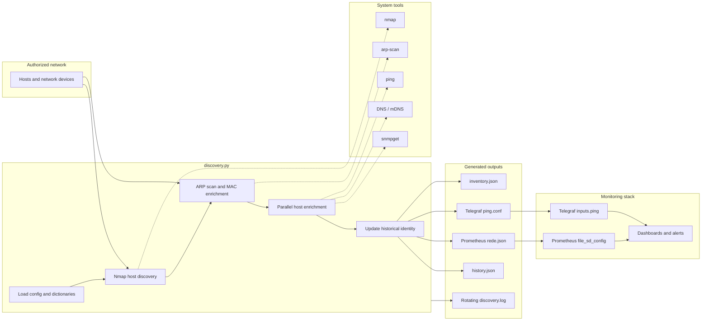
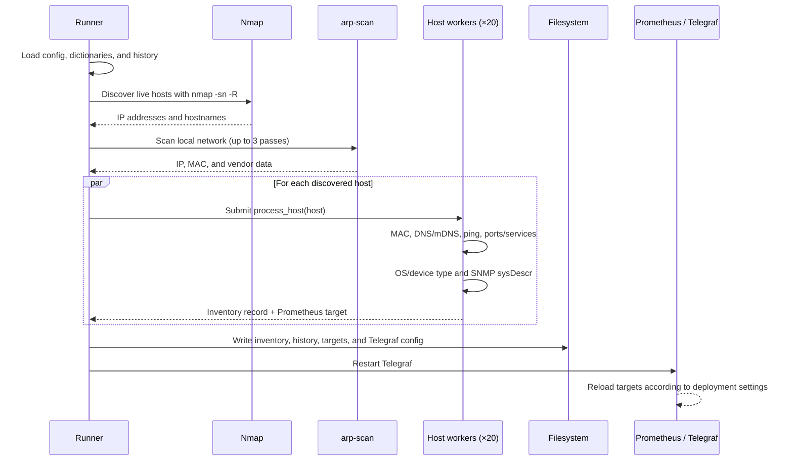

<div align="center">

# Network Discovery for Prometheus

**Automated network asset discovery, inventory enrichment, and observability target generation.**

[](https://www.python.org/)
[](https://prometheus.io/docs/prometheus/latest/configuration/configuration/#file_sd_config)
[](https://www.influxdata.com/time-series-platform/telegraf/)
[](LICENSE)

Discover devices once. Enrich them consistently. Monitor them automatically.

</div>

---

## Contents

- [Overview](#overview)
- [Why this project](#why-this-project)
- [Architecture](#architecture)
- [Discovery data flow](#discovery-data-flow)
- [Capabilities](#capabilities)
- [Repository layout](#repository-layout)
- [Requirements](#requirements)
- [Installation](#installation)
- [Configuration](#configuration)
- [Running a discovery](#running-a-discovery)
- [Generated artifacts](#generated-artifacts)
- [Prometheus integration](#prometheus-integration)
- [Telegraf integration](#telegraf-integration)
- [Operational considerations](#operational-considerations)
- [Troubleshooting](#troubleshooting)
- [Roadmap](#roadmap)
- [Contributing](#contributing)

## Overview

`network-discovery-prometheus` is a lightweight Python discovery runner for Linux networks. It combines active host discovery, ARP/MAC resolution, DNS and mDNS lookup, latency checks, service inspection, operating-system detection, and optional SNMP identification into a durable inventory.

The same run produces Prometheus `file_sd_config` targets and a Telegraf ping configuration, so newly discovered devices can become observable without manually maintaining target lists.

> **Scope:** run this only on networks you own or are explicitly authorized to assess. Network scanning can be intrusive and may trigger security controls.

## Why this project

Manual target management becomes unreliable as networks change. This project creates a repeatable pipeline:

```text
┌─────────────────────┐     ┌────────────────────┐     ┌──────────────────────┐
│ Network              │     │ Discovery runner   │     │ Observability         │
│ devices              │ ──▶ │ discovery.py      │ ──▶ │ Prometheus + Telegraf │
│ servers, switches,   │     │ scan · enrich ·    │     │ dynamic targets       │
│ printers, IoT        │     │ persist            │     │ and reachability      │
└─────────────────────┘     └────────────────────┘     └──────────────────────┘
                                      │
                                      ▼
                           ┌────────────────────┐
                           │ inventory.json     │
                           │ history.json       │
                           │ discovery.log      │
                           └────────────────────┘
```

## Architecture



### Runtime sequence



## Capabilities

| Area | What it does |
| --- | --- |
| **Host discovery** | Uses Nmap ping/host discovery with reverse DNS resolution. |
| **Layer-2 identity** | Resolves MAC addresses through `arp-scan`, including retries for individual hosts. |
| **Enrichment** | Collects hostname, vendor, latency, OS, device type, open TCP ports, service banners, and SNMP `sysDescr`. |
| **Classification** | Applies MAC/name, vendor, and device-type dictionaries to make raw scan data useful to operators. |
| **Concurrency** | Processes hosts with `ThreadPoolExecutor(max_workers=20)`. |
| **History** | Tracks first/last observation, known IP addresses, vendor, device type, OS, and latency by MAC address. |
| **Observability** | Generates Prometheus file-based discovery targets and Telegraf ping inputs. |
| **Operations** | Writes rotating logs (10 MiB per file, five backups) and restarts Telegraf after generation. |

## Repository layout

```text
.
├── discovery.py   # Discovery, enrichment, persistence, and integrations
└── README.md      # Architecture and operating guide
```

Runtime data files are intentionally described below because this repository currently contains the runner and documentation; deployment-specific dictionaries and output files are created or supplied at runtime.

## Requirements

### Operating system and permissions

- Linux host with access to the target network.
- Python 3.9+ recommended.
- Privileges sufficient for ARP/Nmap inspection and writing the configured output paths. Running with `sudo` is the simplest deployment option, but a narrowly scoped service account and capabilities are preferable for production.

### System packages

```bash
sudo apt update
sudo apt install -y \
  python3 \
  nmap \
  arp-scan \
  iputils-ping \
  snmp \
  avahi-utils
```

`snmp-mibs-downloader` may be useful on Debian/Ubuntu systems, although the current runner queries the numeric OID for `sysDescr`.

## Installation

```bash
git clone https://github.com/paulocfmarques-collab/network-discovery-prometheus.git
cd network-discovery-prometheus

python3 --version
chmod +x discovery.py
```

No third-party Python package is required by the current script; it uses the Python standard library and external Linux utilities listed above.

## Configuration

Create `config.json` in the repository directory. The script reads the `linux` section at startup:

```json
{
  "linux": {
    "network": "192.168.1.0/24",
    "localhost": "192.168.1.10"
  }
}
```

| Key | Required | Description |
| --- | --- | --- |
| `network` | Yes | CIDR range passed to Nmap, for example `192.168.1.0/24`. |
| `localhost` | Yes | Local host IP. It receives a special MAC lookup path using `/sys/class/net/eth0/address`. |

Optional lookup files can be placed beside `discovery.py`:

- `mac_dictionary.json`: exact MAC address to friendly name.
- `vendors_dictionary.json`: vendor/OUI lookup used when ARP data is unknown.
- `type_dictionary.json`: fallback MAC/device classification mapping.

Example:

```json
{
  "00:11:22:33:44:55": "Core switch"
}
```

> The current implementation uses the SNMPv2c community string `public` and the `sysDescr.0` OID. Treat this as a lab/default behavior and harden it before production use.

## Running a discovery

```bash
sudo python3 discovery.py
```

The run performs the following high-level operations:

1. Loads configuration, dictionaries, and historical state.
2. Discovers hosts with Nmap.
3. Performs up to three local ARP scans.
4. Enriches hosts concurrently.
5. Writes inventory and monitoring artifacts.
6. Updates history and restarts Telegraf.

To inspect the most recent run:

```bash
tail -f discovery.log
python3 -m json.tool inventory.json
```

For unattended execution, schedule the command with a systemd timer or cron after validating scan duration and the impact on your network.

## Generated artifacts

| Artifact | Default path | Purpose |
| --- | --- | --- |
| Inventory | `inventory.json` | One enriched record per discovered host. |
| History | `history.json` | Persistent MAC-based identity and IP history. |
| Prometheus targets | `/etc/prometheus/targets/rede.json` | File-based discovery targets with labels. |
| Telegraf config | `/etc/telegraf/telegraf.d/ping.conf` | One `inputs.ping` block per discovered host. |
| Logs | `discovery.log` | Rotating execution and error log. |

Inventory records contain fields such as `ip`, `hostname`, `mac`, `vendor`, `device_type`, `previous_ips`, `latency_ms`, `os`, `open_ports`, `services`, and `snmp_sysdescr`.

A generated Prometheus target has this shape:

```json
[
  {
    "targets": ["192.168.1.100"],
    "labels": {
      "friendly_name": "server01",
      "ip": "192.168.1.100",
      "mac": "00:11:22:33:44:55",
      "vendor": "Example Vendor",
      "device_type": "server",
      "os": "Linux",
      "latency_ms": "0.421",
      "network": "192.168.1.0/24"
    }
  }
]
```

## Prometheus integration

Configure Prometheus to watch the generated file:

```yaml
scrape_configs:
  - job_name: network-discovery
    file_sd_configs:
      - files:
          - /etc/prometheus/targets/rede.json
    relabel_configs:
      - source_labels: [__address__]
        target_label: instance
```

For an exporter such as Blackbox or SNMP Exporter, use the generated target labels and relabel the target into the exporter-specific parameter. Ensure the Prometheus process can read the target file and that your deployment reloads configuration/file-SD changes according to its operating model.

## Telegraf integration

The runner writes one ping input per inventory item, for example:

```toml
[[inputs.ping]]
  urls = ["192.168.1.100"]
  count = 3
  timeout = 2.0

  [inputs.ping.tags]
    device = "server01"
```

The script then invokes:

```bash
systemctl restart telegraf
```

Make sure the executing user can write `/etc/telegraf/telegraf.d/ping.conf` and restart the service. In a high-availability or change-sensitive environment, replace the unconditional restart with a validated reload strategy.

## Operational considerations

### Security

- Scan only authorized address ranges.
- Restrict permissions on `history.json`, `inventory.json`, and logs; they may expose topology and service information.
- Replace the hard-coded SNMP `public` community with a configurable secret and prefer SNMPv3 where possible.
- Avoid exposing generated target files or scan logs through an untrusted web server.

### Reliability

- Confirm the discovery host has the correct interface and route to the target network.
- Expect incomplete enrichment for firewalled, sleeping, or non-ARP devices.
- Nmap OS and service detection can be slow; tune scan scope and scheduling for larger networks.
- Review output files atomically in production so monitoring never reads a partially written file.
- Validate generated configuration before restarting Telegraf or reloading monitoring services.

### Data quality

MAC addresses are the primary historical identity. Devices behind NAT, virtual interfaces, MAC randomization, or changing hardware can therefore appear as new identities. Treat the inventory as operational discovery data, not as an authoritative CMDB.

## Troubleshooting

| Symptom | Checks |
| --- | --- |
| No hosts found | Validate `config.json`, CIDR notation, routing, firewall rules, and Nmap permissions. |
| Missing MAC/vendor | Confirm L2 adjacency and `arp-scan --localnet`; add a vendor lookup entry when appropriate. |
| Empty OS/type | OS fingerprinting needs reachable ports and suitable privileges; use dictionary fallbacks where appropriate. |
| Missing SNMP description | Confirm UDP/161 reachability, SNMP version/community, and device ACLs. |
| Prometheus sees no targets | Check file permissions, JSON validity, Prometheus path, and `promtool check config`. |
| Telegraf does not start | Inspect `journalctl -u telegraf`, validate the generated TOML, and verify service permissions. |

Useful commands:

```bash
sudo arp-scan --localnet
nmap -sn -R 192.168.1.0/24
python3 -m json.tool inventory.json
sudo promtool check config /etc/prometheus/prometheus.yml
sudo journalctl -u telegraf -n 100 --no-pager
```

## Roadmap

- [ ] Web dashboard and REST API
- [ ] NetBox integration
- [ ] PostgreSQL-backed inventory
- [ ] Containerized deployment
- [ ] Dedicated Prometheus exporter
- [ ] IPv6 discovery
- [ ] Configurable SNMP credentials and scan profiles
- [ ] Atomic output writes and configuration validation

## Contributing

1. Fork the repository.
2. Create a focused branch:

   ```bash
   git checkout -b feature/my-improvement
   ```

3. Test against an authorized lab network.
4. Keep documentation and operational requirements in sync with code.
5. Commit clearly and open a pull request with the behavior, risks, and validation steps.

## License

This project is distributed under the MIT License. See [`LICENSE`](LICENSE) when available in the repository.

## Author

**Paulo Cesar Furlanetto Marques**  
[github.com/paulocfmarques-collab](https://github.com/paulocfmarques-collab)

<div align="center">

If this project helps you keep network inventory and monitoring aligned, consider giving it a ⭐.

</div>
